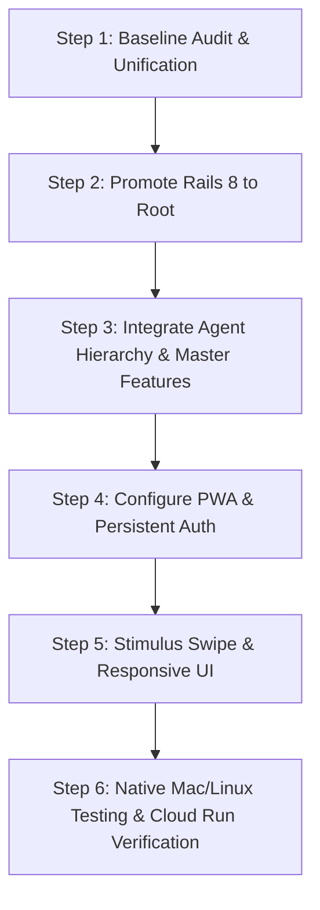

# Septober Modernization Strategy: Rails 8 + Native PWA

**Author:** Riccardo Carlesso & Antigravity  
**Date:** September 6, 2026  
**Status:** APPROVED / IN PROGRESS  
**Target Architecture:** Ruby 3.4+ / Rails 8.0.x / Hotwire (Turbo 8 + Stimulus) / Standalone PWA  

---

## 1. Executive Summary & Context

Septober was originally conceived in 2010 on **Ruby 1.9.3** and **Rails 3.0.3**. While its domain model—todos with priorities, deadlines, locations, projects, tags, and context—was decades ahead of its time, its technical foundation became trapped in legacy container images (`gcr.io/ric-cccwiki/septober-mysql:2.3.12`) that cannot even compile natively on modern Apple Silicon Macs.

In late 2025, an initial "Fresh Start" experiment proved Rails 8.0 viability (`septober_v8` in branch `origin/rails-5-upgrade`). Concurrently in early September 2026, `master` received critical advancements:
- Multi-agent parent/child user hierarchy (Hermes, Lobby, Pux sub-accounts).
- Agent badges and inline task manipulation.
- Direct JSON API for CLI and agentic workflows.

This document establishes the **permanent strategic roadmap** for unifying Septober into a **modern Rails 8 monolith with a zero-maintenance native PWA**, delivering a desktop-class and mobile-class application without the architectural burden of maintaining a separate Flutter or Electron codebase.

---

## 2. Client Architecture Evaluation: PWA vs. Flutter vs. Electron

| Dimension | Rails 8 Native PWA | Flutter Desktop | Electron |
| :--- | :--- | :--- | :--- |
| **Codebase Overhead** | **1 unified codebase (Rails 8)** | 2 separate codebases (Dart + Rails) | 2 codebases or heavy wrapper |
| **Mac & Linux Experience** | Native standalone window via "Add to Dock" | True compiled native application | Heavy Chromium browser window |
| **RAM & CPU Impact** | Minimal (~system WebKit/Chromium engine) | Very low (compiled C++/Skia/Impeller) | High (200MB - 500MB idle RAM) |
| **Auth & Session Persistence** | Transparent session & persistent cookies | Keyring / Token storage logic needed | LocalStorage / Cookie jar management |
| **Swipe & Gestures** | ✅ Stimulus touch/pointer gesture controller | ✅ Nativo gesture engine | ✅ Web library (Hammer.js/interact) |
| **Offline Capability** | Service Worker offline cache | Native local SQLite/Isar | IndexedDB / SQLite |
| **Maintenance Burden** | **Lowest** (change view once, updates all) | High (API serialization, schema drift) | High (Electron security updates) |

### Strategic Decision:
1. **PWA First (The Rails 8 Way)**:
   - Rails 8 ships with first-class PWA generators (`pwa/manifest.json.erb`, `service-worker.js`).
   - On macOS Safari & Chrome, selecting **"Add to Dock"** creates a standalone `.app` bundle that runs in its own window, with its own icon in Dock and App Switcher (`Cmd+Tab`), completely isolated from the browser UI.
   - On Linux (GNOME / KDE / Chrome), PWA installs directly to the application desktop launcher.
   - **Login persistence** is handled seamlessly via HTTP-only secure remember-me cookies.
   - **Touch & Swipe** can be executed natively in CSS + Stimulus in less than 60 lines of code.
2. **Flutter as Phase 2 (Optional)**:
   - If—and only if—deep OS integration (e.g. native Mac menu bar widget, offline background sync, or native iOS widget) is later required, the Rails 8 REST API (`/api/todos`) will already be in place to back a Flutter app.
3. **Electron is Rejected**:
   - Running an entire Chromium instance for a personal productivity tool introduces unnecessary bloat and battery drain.

---

## 3. Rails 8 Modernization Blueprint

### 3.1 Core Stack Specifications
- **Ruby:** 3.4.5 (installed natively via `rbenv`)
- **Rails:** 8.0.x
- **Asset Pipeline:** Propshaft + Importmaps (zero Node.js / Webpack / Vite build step)
- **Database:** SQLite 3 for local development; MySQL / Cloud SQL for GCP production
- **Background Jobs & Cache:** `solid_queue`, `solid_cache`, `solid_cable` (database-backed, zero Redis requirement)
- **Deployment:** Standard slim Dockerfile + Kamal / Cloud Run

### 3.2 Bridging the Gap: What Must Be Ported from `master`
The Rails 8 upgrade will merge the scaffolded `septober_v8` work with the September 2026 features on `master`:
1. **User Model Agent Hierarchy (`parent_id`, `is_agent`, `agent_host`, `agent_icon`)**:
   - Preserves family scoping (`family_user_ids` where a human parent sees tasks across sub-agents).
   - Agent icon resolution (`🚛` for Ermete, `🦞` for Lobby, `🐾` for Pux, `🤖` for generic).
2. **Agent UI Badges & Filters**:
   - Visual chips on todos showing which agent created or owns the item.
   - Filter bar to switch between Personal, Work, or Sub-Agent views.
3. **API Endpoints (`/api/todos`)**:
   - JSON API compatibility for `bin/septober` CLI and Hermes Telegram bot integration.

---

## 4. Native PWA & Mobile/Desktop UX Blueprint

### 4.1 Web App Manifest (`app/views/pwa/manifest.json.erb`)
```json
{
  "name": "Septober",
  "short_name": "Septober",
  "icons": [
    { "src": "/icons/icon-192.png", "type": "image/png", "sizes": "192x192" },
    { "src": "/icons/icon-512.png", "type": "image/png", "sizes": "512x512" },
    { "src": "/icons/icon-512.png", "type": "image/png", "sizes": "512x512", "purpose": "maskable" }
  ],
  "start_url": "/",
  "display": "standalone",
  "orientation": "portrait-primary",
  "background_color": "#121212",
  "theme_color": "#d9381e"
}
```

### 4.2 Touch & Pointer Swipe Controller (`swipe_controller.js`)
Using Stimulus and CSS transforms:
- **Swipe Right (> 80px)**: Highlights green (`✓ Complete`), triggers Turbo stream or fetch call to `/todos/:id/toggle` (done).
- **Swipe Left (> 80px)**: Highlights amber (`💤 Procrastinate`), triggers call to `/todos/:id/procrastinate`.
- Works identically with touch on smartphones/tablets and trackpad drag/click on macOS/Linux.

### 4.3 Persistent Authentication
- Rails 8 session store configured with `permanent.signed[:session_id]` or a dedicated `remember_token` column on `User`.
- User remains logged in permanently on their personal Mac, Linux workstation, or phone.

---

## 5. Execution Roadmap



1. **Step 1: Unification**: Consolidate `septober_v8` files into root, replacing the Rails 3 code while safeguarding the git history.
2. **Step 2: Database Migration & Models**: Ensure schema supports both standard todos and the `User` agent hierarchy columns.
3. **Step 3: PWA Configuration**: Provide responsive meta tags, manifest, service worker, and crisp app icons.
4. **Step 4: Stimulus Interaction Layer**: Add swipe interactions, keyboard shortcuts (`j`/`k`/`x`), and quick inline creation.
5. **Step 5: Verification**: Boot on Ruby 3.4.5, test standalone PWA window on macOS, verify CLI API functionality.
